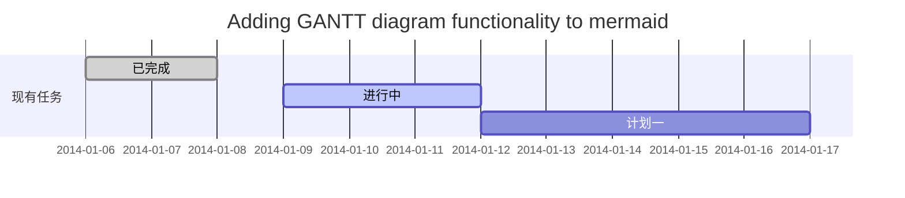

**应用部署小程序，练习用**

1. 运行sql(order/src/main/sql/order.sql)语句，配置数据库;
2. 根据自己数据库服务器的实际参数配置applicationContext.xml中的相应参数;
   a）DB Host
   b）DB Port
   c）DB Username
   d）DB Password
3. 完成配置之后能可以运行spring程序;

